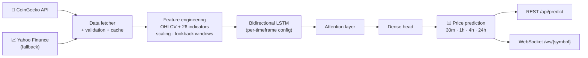

<div align="center">


# Crypto Price Prediction API — BiLSTM with Attention, FastAPI & Real-Time WebSockets

**Bitcoin, Ethereum and altcoin price forecasting across 30-minute to daily timeframes — trained on demand, served over REST and streamed live over WebSockets.**

<p>
  
  
  
  
  
  
  
</p>

[Features](#-features) · [Model](#-model-architecture) · [Quick start](#-quick-start) · [API](#-api-endpoints) · [Disclaimer](#%EF%B8%8F-disclaimer)

</div>

---

**CryptoAion AI** is a **machine-learning cryptocurrency price prediction system** built on **FastAPI** and **PyTorch**. A **bidirectional LSTM with an attention mechanism** learns from OHLCV history plus 26 engineered **technical indicators**, with separate tuned configurations for the **30m, 1h, 4h and 24h** timeframes. Market data comes from **CoinGecko** with automatic fallback to **Yahoo Finance**, and predictions can be streamed to clients in real time.

> This is the actively developed **v2**. The earlier snapshot lives at [crypto-price-prediction-api](https://github.com/intikhab49/crypto-price-prediction-api).

## ✨ Features

| | Feature | Details |
|---|---|---|
| 🧠 | **BiLSTM + attention** | PyTorch model with per-timeframe hidden size, depth, dropout, lookback and learning rate |
| ⏱️ | **Multi-timeframe forecasting** | `30m` · `1h` · `4h` · `24h` |
| 🔁 | **On-demand training** | Trains or retrains a model for a new coin/timeframe the first time it's requested, with early stopping |
| 📐 | **Feature engineering** | 26 technical indicators (via `ta`), data-quality validation, support/resistance detection |
| 🌐 | **Resilient data layer** | CoinGecko (free or Pro) with automatic fallback to Yahoo Finance, local parquet cache |
| ⚡ | **Real-time streaming** | WebSocket endpoint pushes live price and prediction updates per symbol |
| 🔐 | **Auth** | JWT register/login, admin login and user management (Tortoise ORM) |
| 🧪 | **Research notebooks** | BiLSTM hourly BTC notebook and an XGBoost trading-bot notebook with saved BTC/ETH/BNB models |
| 🐳 | **Deploy-ready** | Dockerfile (4 Uvicorn workers), Procfile, Vercel config |

**Supported coins:** BTC · ETH · BNB · XRP · ADA · DOGE · SOL — plus any symbol that resolves on CoinGecko or Yahoo Finance.

## 🧠 Model architecture



Each timeframe has its own lookback window and hyperparameters in `simple_config.py` (for example, `30m` uses 30 days of history with a 48-bar lookback). Trained weights are saved per symbol and timeframe and reused until you force a retrain.

## ⚡ Quick start

```bash
git clone https://github.com/intikhab49/cryptoaion-price-prediction.git
cd cryptoaion-price-prediction

python -m venv env
source env/bin/activate            # Windows: .\env\Scripts\activate
pip install -r requirements.txt
```

Create a `.env` file:

```ini
COINGECKO_API_KEY=your_api_key_here   # optional — free tier works without it
DATABASE_URL=sqlite://db.sqlite3
MODEL_PATH=models
CACHE_DIR=cache
LOG_LEVEL=INFO
PORT=8000
HOST=0.0.0.0
```

```bash
python run_migrations.py
uvicorn main:app --reload
```

Interactive docs: **http://localhost:8000/docs** · ReDoc: **http://localhost:8000/redoc**

**With Docker:**

```bash
docker build -t cryptoaion .
docker run -p 8000:8000 --env-file .env cryptoaion
```

## 📡 API endpoints

| Method | Endpoint | Description |
|---|---|---|
| GET | `/api/predict/{symbol}?timeframe=1h` | Price prediction for a symbol and timeframe (`force_retrain` optional) |
| GET | `/api/data/info/{symbol}` | Coin information |
| GET | `/api/data/realtime/{symbol}` | Real-time price data |
| GET | `/api/data/historical/{symbol}` | Historical OHLCV data |
| GET | `/api/coingecko/realtime` · `/historical/{coin_id}` · `/by-symbol/{symbol}` | Direct CoinGecko data |
| GET | `/api/yfinance/historical/{symbol}` · `/info/{symbol}` | Direct Yahoo Finance data |
| POST | `/api/auth/register` · `/login` · `/admin/login` · `/logout` | JWT authentication |
| GET | `/api/auth/me` · `/admin/users` | Current user · user management |
| WS | `/ws/{symbol}` | Live price + prediction stream |
| GET | `/health` | Health check |

```bash
curl "http://localhost:8000/api/predict/BTC?timeframe=4h&force_retrain=false"
```

More detail: [`API_DOCUMENTATION.md`](API_DOCUMENTATION.md) · [`FRONTEND_INTEGRATION_GUIDE.md`](FRONTEND_INTEGRATION_GUIDE.md)

## 🗂️ Project structure

```
main.py               # FastAPI app, routers, Tortoise ORM lifecycle
simple_config.py      # settings + per-timeframe model hyperparameters
controllers/          # data fetching, feature engineering, model training/management, websockets
routes/               # prediction, market data, CoinGecko, Yahoo Finance, auth, websocket routers
streamlit_app/        # Streamlit dashboard
*.ipynb               # BiLSTM and XGBoost research notebooks
Dockerfile · Procfile · vercel.json
```

## ⚠️ Disclaimer

Research and educational software. **Not financial advice.** Crypto markets are noisy and non-stationary; a model that fits history well can still lose money live. Evaluate out-of-sample, account for fees and slippage, and never trade what you can't afford to lose.

---

<div align="center">

**Built by [Intikhab Azam](https://github.com/intikhab49)** — AI engineer · machine learning · AI agents · automation

<sub>Keywords: crypto price prediction · Bitcoin price prediction · LSTM · BiLSTM attention · deep learning time series forecasting · PyTorch · FastAPI · WebSocket · CoinGecko API · Yahoo Finance · technical indicators · Python</sub>

</div>
